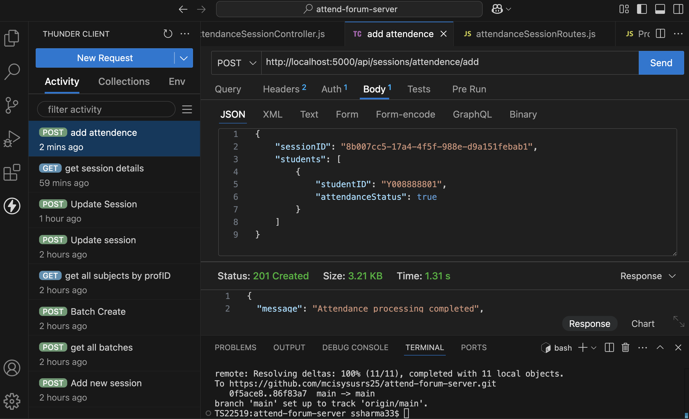

# Forum Server

## Overview
Forum Server is a comprehensive attendance management system designed for educational institutions. It facilitates seamless onboarding of professors and students, batch management, attendance tracking, and AI-powered analytics.

## Features

### Authentication & Onboarding
- Login with Institution Credentials
- OTP Verification during onboarding
- Role-based login for Students, Professors, and Admins

### Student & Batch Management
- Create Student Batches
- Add Students to Batches
- Edit Batch Information
- Assign Subjects to Batches

### Attendance Management
- Create Attendance Sessions
- Geo-location based Attendance Validation
- Activate, Manage, and Complete Sessions
- Export Attendance Session Logs
- View and Analyze Session History
- Exception Attendance Handling

### Reports & Analytics
- Generate Attendance Reports
- Maintain Attendance Logs
- AI-powered Data Analytics & Visualizations
- Generate Insights based on Attendance Data

### Notifications & Security
- Email Notifications for Attendance & Sessions
- OTP Verification for Secure Onboarding

## Usage
1. **Login**: Authenticate using institution credentials.
2. **Onboard Users**: Register professors and students via OTP verification.
3. **Batch & Subject Management**: Create and manage student batches and subjects.
4. **Attendance Tracking**:
   - Start an Attendance Session
   - Validate Attendance via Geo-location
   - Manage, Activate, and Complete Sessions
5. **Reporting & Analytics**:
   - Generate logs and insights
   - View session history
   - Export reports

## Technologies Used
- Backend: [Specify backend technology]
- Database: [Specify database]
- AI & Analytics: [Specify AI tools]
- Authentication: OTP-based verification

## Installation & Setup
1. Clone the repository:
   ```sh
   git clone [repository-url]
   ```
2. Navigate to the project directory:
   ```sh
   cd forum-server
   ```
3. Install dependencies:
   ```sh
   [command to install dependencies]
   ```
4. Configure environment variables:
   ```sh
   [steps to configure environment variables]
   ```
5. Start the server:
   ```sh
   [command to start the server]
   ```

## License
MIT

## Contact
For support, contact ssharma33@student.ysu.edu


